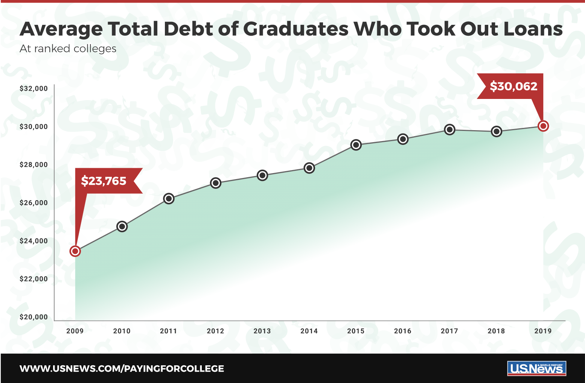
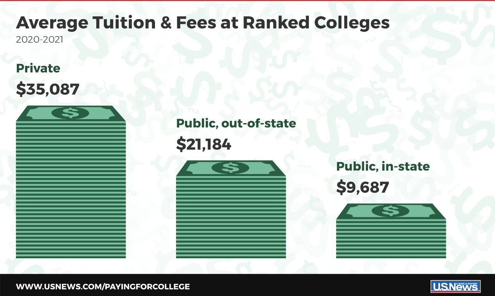

```{r setup, include=FALSE}
library(knitr)
opts_chunk$set(fig.align='center', message=FALSE, cache=TRUE)
output <- opts_knit$get("rmarkdown.pandoc.to")
if(!is.null(output)) {
  if(output=="html") opts_chunk$set(out.width = '400px') else
    opts_chunk$set(out.width='.6\\linewidth')
}
```

```{r library dependency, echo=FALSE}
library(png)
library(ggpubr)
library(ggplot2)
library(usmap)
library(tm)
library(reshape2)
library(dplyr)
library(tidyr)
library(reshape2)
library(data.table)
library(tidyselect)
library(plotly)
library(lubridate)
library(readr)
library(stringr)
library(tidyselect)
```

\newpage  
\tableofcontents  
\listoffigures  
\newpage

Introduction
==================

Motivation
------------------------------------------
{#id1 .class width="50%" height="50%"}  

The outstanding college student loan debt has reached an all-time high of $1.41 trillion in 2019, average $30,000 for each college students according to [**Figure 1** from U.S News report on student loan](https://www.usnews.com/education/best-colleges/paying-for-college/articles/see-how-student-loan-borrowing-has-risen-in-10-years), which demonstrated by the graph above showing 10 Years of average total student loan debt. There is no clear guideline application for pre-college student or transfer students to search state-wide college tuition data as an important reference before applying for U.S. College.   

The main motivation behind this project is to give a reference for them when they starting to apply for U.S. College, potentially avoid their regrets of endure high student loan debt after entered dreaming college for years. Our team wants to build an interactive application and report on U.S. college tuition which present clean and clear graphs and conclusion based on user's options such as Degree-length, School-Type, and In/Out-State.   

Secondary motivation in hindsight will hopefully be able to grab attention from United States Department of Education (ED) so that they can make some policies to slow down the increasing trend of college tuition fee and flat the curve of outstanding college student loan debt, which is definitely help a lot to the sustainable development of U.S. college.  


Related Applications 
------------------------------------------
{#id2 .class width="51%" height="51%"}

There are several open source tables and application that related to our project. Thanks them for these data models, they provide some inspirations to our subtopic, like [**Figure 2** from U.S News report on Average College Tuition](https://www.usnews.com/education/best-colleges/paying-for-college/articles/paying-for-college-infographic), which show us a view of average college Tuition in 2020-2021. In [**EducationData**](https://educationdata.org/average-cost-of-college) website, we are able to view a list of table about average cost of college with analysis such as "why expensive?", "Cost by State", and "Room and Board On and Off Campus". More importantly, it has a nice work flow to discuss all the plots based on research which we can learn from it.  

The [**TuitionTracker**](https://www.tuitiontracker.org/) web application is powered by U.S. Department of Education data from IPEDS(Integrated Postsecondary Education Data System, a service provided by the National Center for Education Statistics). This interactive web tool shows what students really pay for college based on their family income with more than 3,800 colleges and universities in the United States.   

Another online application called [**CollegeTuitionCompare**](https://www.collegetuitioncompare.com/search/) provide a nice bar plot about in-state vs out-of-state tuition comparison. The application also include the graduation rates and diversity which help parents and students compare colleges using data that shows what schools actually cost the year student expect to enroll. They have highlighted the essential data such as financial aid and application stats so important data are transparent to users.  


Observations and Questions
------------------------------------------
From the existing web applications and tables, we find most of these data products having too much information even somewhat messy. The main problem is that they do not have options for users to choose what kind of information they want to view and compare so they just pop up a long form report including all the details.   

For example, it do give essential data such as Tuition difference between in-state and out-of-state, graduation rate, admission stats, and etc. However, it also include Not that important data such as student to faculty ratio, dormitory capacity, and average earning after 10 years of graduation with salary range.    

In our project, our analysis will focus on essential information for pre-college student and transfer student such as tuition difference between in-state and out-of-state, tuition increasing graph based on yearly report, and tuition difference between school type, and etc. In this way, our report will be more efficient and useful compared to the existing research based on U.S. college tuition.   

Our hypothesis is to explore which state has the most expensive tuition and which region has the most selective for pre-college student and college student to apply for college across the country. 

\newpage 

Design of Data and Methodology  
====================================
```{r dataset read and modified, echo=FALSE}
data_date <- read.csv("data/historical_tuition.csv")
data_tc <- read.csv("data/tuition_cost.csv")
data.df <- data_tc
data.df <- data.df[complete.cases(data.df[,2:2]),]
```

```{r average_tuition, echo=FALSE}
average_in_state <- tapply(data.df$in_state_total, data.df$state_code, mean)
average_out_of_state <- tapply(data.df$out_of_state_total, data.df$state_code, mean)
survey_summary <- data.frame(state_name = 
               names(tapply(data.df$in_state_total, 
                            data.df$state_code, mean)),
             mean_in_state=average_in_state,
             mean_out_of_state=average_out_of_state)
survey_summary$total_mean <- rowMeans(survey_summary[,c("mean_in_state", "mean_out_of_state")])
colnames(survey_summary)[1] = "state"
```


Data Resource and Explanation of Variables 
------------------------------------------
The aim of data collection definitely focus on if the dataset contains state and tuition amount column, school-type column, and tuition-type column. Ideally, we want to a dataset contains yearly report for each college so we can plot a date trend series graph based on that dataset. College tuition data is somewhat difficult to find - with many sites limiting it to online tools.    

Thanks to [**Chronicle of Higher Education**](https://www.chronicle.com/article/tuition-and-fees-1998-99-through-2018-19/), we were able to get a table of information about tuition and fees of nearly 3,000 colleges/universities from the 1998-99 to the 2019-20 academic year, along with school type, degree length, state, in-state vs out-of-state as shown in Table 1.   

```{r kable for related variables, echo=FALSE}
cost <- matrix(colnames(data.df), ncol = 1)
colnames(cost)[1] <- "Related-Variable"
cost <- cbind(cost, Description=c("School name", "State name", "State abbreviation", "School type: public, private, for-profit", "4 year or 2 year degree", "Room and board in USD", "Tuition for in-state residents in USD", "Total cost for in-state residents in USD", "Tuition for out-of-state residents in USD", "Total cost for out-of-state residents in USD"))
history <- matrix(colnames(data_date), ncol = 1)
colnames(history)[1] <- "Related-Variable"
history <- cbind(history, Description=c("Type of school: All, Public, Private", "Academic year", "Tuition Type: All Constant/Current, 2/4 Year Degree Constant/Current", "Tuition cost in USD"))
history <- history[-1,] 
variable <- rbind(cost, history)
kable(variable, caption = "The related-variables in our data set.")
```

These related-variables are documented and will be used for our research after reshaping and analyzing the original dataset. Having a data product on college tuition is useful and necessary for pre-college or high school students who want to have a point of reference when they apply for college. 

The data for this project was obtained via the websites mentioned above and compiled into one CSV file to be read into R. Although the data set is good, it is missing some values and state information. So, after we read the CSV file, we use the complete.case function to remove empty spots inside the data set and use the usmap library to filter the state name column of the data set. 

The data used in this project to produce data plots can be found in the [**Kaggle** dataset website](https://www.kaggle.com/jessemostipak/college-tuition-diversity-and-pay?select=historical_tuition.csv). This website provides the yearly college tuition data for the United States. This website provides reshaped data to some extent which is originally from the [National Center for Education Statistics (**NCES**)](https://nces.ed.gov/fastfacts/display.asp?id=76) - spanning the years 1985 - 2016. From this site, enough data was obtained to create two interactive and informative data plots.


Preparing the Data 
------------------------------------------
Reshape original data to readable data set is a major part of this report. We spend a lot of time to extract data using several different functions of library and package in R.   

The data set originally comes from the US Department of Education. The most comprehensive and easily accessible data cames from TuitionTracker.org who allows for a .csv download! Unfortunately it's in a very wide format that is not ready for analysis, but tidyr R library can make quick work of that with pivot_longer().   

It has a massive amount of data, we have filtered it down to a few tables as seen in the attached .csv files. Tuition data can be quickly joined by dplyr::left_join(tuition_cost, diversity_school, by = c("name", "state")). Some of the other tables can also be joined but there may be some fuzzy matching needed.    

The Tuition and fees by college/university for 2018-2019, along with school type, degree length, state, in-state vs out-of-state from the Chronicle of Higher Education.    

The Historical averages from the National Center for Education Statistics (NCES) - spanning the years 1985 - 2016.    

Before we use this data set to explore the costs of college tuition in the US on their own, by geographic area, degree type, we have applied functions to reshape the data set. Here is the summary of the process:    

1. Drill in on the seemingly most popular regions using the "include" parameter in the plot_usmap() function. Regional divisions can be found in the doc of us_regdiv.pdf here.   

2. There were lots of missing data for room and board fee which will be added to total tuition fee in the end so we remove these rows when we want to compare these in-state tuition total and out-of-state tuition total.      

3. The original dataset do have a column to showing the states name. In order to simplify the output, we use merge anther column called Abbreviation to make room for the map view of US college tuition in state wise.    

4. Due to we use two different data set in this report, we only use couple columns in the history data set in order to not duplicate the information such as room and board, college name, state name are duplicated in these two data sets.   

5. Original history data set do not use typically academic year but in the format such as 2008-09 format, we change them to 20xx year format so that we can plot data year by year.    

6. In order to compare the tuition data in state wise, we have to calculate the average tuition for each state because there might have more than 50 college in one state but less than 10 college in another state.     

7. We have a docs for each columns field for these two data sets. In order to illustrate them to readers, we create a table for each columns names and descriptions for that to help understand.     

8. In order to zoom in the area of our findings, we use filter function to only display the corresponding information. For example, the highest tuition region we only display specific region instead of whole US map.  

9. Showing all the column names and explain each column to readers is hard but we use colnames function to get all column names first. Then we use cbind to append explanation and description. Finally, showing the table using kable function.   


R Library Foundations of the Project
------------------------------------------
This project may be imported into the RStudio environment and compiled by researchers wishing to reproduce this work for newest plot with future data sets, and having new findings or discussions from that.    

> The Core of Statistics were done using R 4.0.2 (R Core Team, 2020-06-22), the ggplot2 (v3.3.2; RStudio Team, 2020-06-19), and the knitr (v1.30; Yihui, 2020-09-22) packages.

For **ggplot2** package, this package has been used for creating graphics such as box plot, line plot, bar plot, and density plot from our reshaped data sets. With built-in theme, we are able to generate decent plots map variables to aesthetics with details to present in this report.      

From **knitr** package, this report is constructed to have reproducibility that it can regenerate the plot based on the latest dataset contains yearly report in the future. Using literate programming techniques for dynamic report generation in R.    

> The Initial Scenarios package is usmap 0.5.1 (Paolo Di Lorenzo, 2020-10-07).

For **usmap** package, we use plot_usmap(based on ggplot object) to plot state wise US map in convenient. The map data frames include Alaska and Hawaii conveniently placed to the bottom left, as they appear in most maps of the US. More over, it built-in function from U.S. Census Bureau help us to filter and divide the whole US map into four regions, which help us to zoom in specific area to analyze.     

> The Most Frequently Used package is dplyr (v1.0.2; RStudio Team, 2020-08-18).

For **dplyr** package, we use a lot of functions to reshape our data set and working with data frame through mutate, filter, arrange, group_by, summarize_all functions. Most of modification to the data set were using these functions list above.    

* **Note**: There are few functions has been used to reshape the data set in other packages. Due to limited usage, we will not list all these packages in this report such as melt function in reshape2 package; ggarange function in ggpubr package; readPNG function in png package. 

\newpage

Exploration on US College Tuition
====================================

Several data plots were generated in order to effectively convey tuition information in different ways. The data plots allow the user to easily view the data.    

State Wise Tuition Scenarios 
------------------------------------------

```{r usmap, echo=FALSE, fig.width=12, fig.height=8, fig.cap="Average tuition per state. The spectrum from white to red indicates an increasing (Expensive) tuition", out.width='100%', out.height='100%'}
plot_usmap(data = survey_summary, values = "total_mean", color = "red", labels = TRUE) + 
  scale_fill_continuous(low = "white", high = "red", 
                        name = "Average Tuition", label = scales::comma) + 
  theme(legend.position = "right",
        legend.title = element_text(size=16), 
        legend.text = element_text(size=18),
        plot.title = element_text(size=24),
        plot.caption = element_text(size=20),
        panel.background = element_rect(colour = "black"))
```


In order to get a nice model for our data set, we use **plot_usmap** function from usmap package to generate US map by state geographically and add settings for theme to help users to compare tuition between two states by color. The spectrum from white to red indicates an increasing (Expensive) pattern from lower to higher tuition. 

**Note** that this is the image at one instance of time (in this case, the 2018-19 academic year). There are 50-state (including Alaska and Hawaii) United States thematic map in the Figure 3, with map scale and with state abbreviations. 

For the given variables: state abbreviation and tuition amount, we use these two column as x-value and y-value for plot_usmap function. The user can view average tuition totals by state name instead of in-state or out-of-state only. 

From this plot, we have a more **intuitive** perception to the data set we are trying to analyze. This is the starting point for the next couple of plots. 

\newpage

Region Wise Tuition Scenarios 
------------------------------------------

```{r side by side box plot, echo=FALSE, fig.cap="Average tuition per region. Show the lowest/highest/Median value in region", out.width='99%', out.height='99%'}
average_state <- survey_summary
average_state <- average_state[-4]
names(average_state)[2:3] <- c("In State", "Out of State")

south_box <- filter(average_state, state %in% usmap:: .south_region)
west_box <- filter(average_state, state %in% usmap:: .west_region)
northeast_box <- filter(average_state, state %in% usmap:: .northeast_region)
midwest_box <- filter(average_state, state %in% usmap:: .midwest_region)

south_box$state <- "south"
west_box$state <- "west"
northeast_box$state <- "northeast"
midwest_box$state <- "midwest"
average_state <- rbind(south_box, west_box, northeast_box, midwest_box)

survey_summary_state <- reshape2::melt(average_state)
colnames(survey_summary_state)[1] <- "Region" 

ggplot(data = survey_summary_state, aes(x=Region, y=value, fill = Region)) + 
  geom_boxplot(alpha=0.3) +
  facet_grid(~variable) +
  theme_classic() +
  theme(plot.background = element_rect(fill = "#BFD5E3"))
```

In general, people would like to know the tuition data in a specific area (most likely near their home) instead of viewing 50 states' data in one graph. In this box plot, we separate the whole data into four areas: NorthEast, West, MidWest, and South for better comparison. We use built-in function defined by U.S. Census Bureau in the usmap library to filter the original data set.  

This box plot of college tuition data allows the user to compare a State's average in-state tuition to its average out-state tuition. This plot makes it easy for the user to see the **mean, maximum and minimum** values of college tuition. More over, with facet with in In-state and Out-of-state, it is easy to see that out-of-state tuition is generally higher than in-state tuition.      

Besides the difference between in-state and out-of-state tuition, we find that the **West** region has relatively the lowest average tuition (around **\$16,248** in-state) for college meanwhile **NorthEast** is the most expensive region (around **\$34,001** in-state) in general, even the tuition fees vary widely with the biggest gap in northeast region.   

\newpage

Comparison between In-state and Out-of-State
------------------------------------------
```{r bar plot for four area, fig.cap = "Tuition Difference for In-state vs Out-State. The red bar in-state and blue bar out-state", out.width='110%', out.height='110%', echo=FALSE}
test_summary <- survey_summary
test_summary <- test_summary[-4]
names(test_summary)[2:3] <- c("In State", "Out of State")

test_summary_tem <- test_summary %>% 
  mutate(diff = test_summary$`Out of State` - test_summary$`In State`) %>%
  arrange(desc(diff))

south_summary <- filter(test_summary, state %in% usmap:: .south_region)
west_summary <- filter(test_summary, state %in% usmap:: .west_region)
northeast_summary <- filter(test_summary, state %in% usmap:: .northeast_region)
midwest_summary <- filter(test_summary, state %in% usmap:: .midwest_region)

south_summary <- reshape2::melt(south_summary)
plot1 <- ggplot(data = south_summary, aes(x=state, y=value, fill = variable))+
  geom_bar(stat = "identity", position = position_dodge(), width=0.5) +
  xlab("State") + ylab("Tuition") + 
  ggtitle("US South Region Tuition") +
  theme_classic() +
  theme(plot.background = element_rect(fill = "#BFD5E3"))

west_summary <- reshape2::melt(west_summary)
plot2 <- ggplot(data = west_summary, aes(x=state, y=value, fill = variable))+
  geom_bar(stat = "identity", position = position_dodge(), width=0.5) +
  xlab("State") + ylab("Tuition") +
  ggtitle("US West Region Tuition") +
  theme_classic() +
  theme(plot.background = element_rect(fill = "#BFD5E3"))

northeast_summary <- reshape2::melt(northeast_summary)
plot3 <- ggplot(data = northeast_summary, aes(x=state, y=value, fill = variable))+
  geom_bar(stat = "identity", position = position_dodge(), width=0.5) +
  xlab("State") + ylab("Tuition") +
  ggtitle("US Northeast Region Tuition") +
  theme_classic() +
  theme(plot.background = element_rect(fill = "#BFD5E3"))

midwest_summary <- reshape2::melt(midwest_summary)
plot4 <- ggplot(data = midwest_summary, aes(x=state, y=value, fill = variable))+
  geom_bar(stat = "identity", position = position_dodge(), width=0.5) +
  xlab("State") + ylab("Tuition") +
  ggtitle("US Midwest Region Tuition") +
  theme_classic() +
  theme(plot.background = element_rect(fill = "#BFD5E3"))

ggarrange(plot1, plot2, plot3, plot4, ncol = 2, nrow = 2, common.legend = TRUE, legend = "bottom")
```

Last plot we divide whole country to four regions and make analyze for each region. We continue our study on data sets with this facet but focus on the difference between in-state and out-of-state tuition. We want to find which state has the most and the least gap between these two variables.  

From this bar plot, people can easily view the difference for specific state and compare states among each region directly. The biggest difference is **Colorado** state with **\$8,637** difference (\$19,523 in-state vs \$28,161 out-state) and minimal difference is **Minnesota** state with **\$985** difference (\$21,975 in-state vs \$22,960 out-state).   

This plot is not just benefit U.S citizen who cares about in-state tuition (Red Bar) for specific state, but also a good reference for the international student who applying for US college to see the differentiation between in-state and out-of-state. There are also some features in this plot that we have already found in previous scenarios.  

\newpage

Trends of Tuition based on school-type and tuition-type
------------------------------------------
```{r tuition history, fig.cap="US College Tuition from 1980 to 2017. Observe the rise in college tuition.", out.width='110%', out.height='110%', echo=FALSE}
data_test <- data_date
data_test$year <- substr(data_test$year, 1, 4)
data_test$year <- as.integer(data_test$year)
data_test <- data_test %>%
  group_by(type, tuition_type, year) %>%
  summarise_all("mean")
ggplot() +
  geom_line(aes(x = year, y = tuition_cost, color = type), data_test) +
  facet_wrap(~tuition_type) +
  xlab("Year") + ylab("Tuition Cost") +
  theme_linedraw() +
  theme(plot.background = element_rect(fill = "#BFD5E3"))
```

When we accomplish the analysis of the tuition data set on the 2017-18 academic year, we want to generate a date series plot to show the time trend for tuition change over years based on history_tuition data set. We facet with school_type and color with tuition_type to show different tuition levels in this date and time series plot.  

According to the chart, it is not difficult to see the increasing trend of college tuition. In the numerical experiment, the tuition for private college has been **numerical double** from **\$21,373** (in 2000) to **\$40,925** (in 2016) for only about sixteen years. Although all-institution and public college-type is not as crazy as private college, it rise from **\$21,373** (in 2000) to **\$40,925** (in 2016). 

Constant dollars based on the Consumer Price Index, prepared by the Bureau of Labor Statistics, U.S. Department of Labor, adjusted to an academic-year basis. In general, constant tuition is inferior to current tuition. When it terms to tuition cost per academic year, 2-year tuition is less than 4-year and all tuition type.  We would explore the college type at following discussion.  


\newpage

Result and Discussion
====================================

The Highest Tuition Region
------------------------------------------
```{r usmap northeast, fig.align = 'center', echo=FALSE, fig.width=12, fig.height=8, fig.cap="Average In-state tuition in NorthEast region. The highest in-state tuition area is RI, MA, and VT states", out.width='71%', out.height='71%'}
plot_usmap(data = survey_summary, values = "mean_in_state", color = "red", labels = TRUE, include = .northeast_region) + 
  scale_fill_continuous(low = "white", high = "red", 
                        name = "In-state Tuition", label = scales::comma) + 
  theme(legend.position = "right",
        legend.title = element_text(size=22), 
        legend.text = element_text(size=18),
        plot.title = element_text(size=24),
        plot.caption = element_text(size=20),
        panel.background = element_rect(colour = "black"))

highest_data.df <- filter(data.df, state_code %in% c("VT", "RI", "MA"))
```


The State Wise Tuition Scenarios (Figure 3) clearly illustrates the variation in tuition costs. However, we want to find out which region has relatively high tuition cost in general so we use built-in function to only present NorthEast region. In this way, we can figure out which state in this region has high tuition cost which then lead to the highest tuition region in U.S.   

Despite what we originally thought about some major cities and States could have relatively high tuition cost such as Seattle, New York City, and California, the college tuition there does not seem to be strongly higher than that of other major cities or States. Instead, **Rhode Island, Massachusetts, and Vermont** have most deepest color in this region.  

Based on our research on these specific three states, there are several private college with expensive tuition cost in these three areas such as Brown University in Rhode Island with **\$70,326**, Amherst College in Massachusetts with **\$71,166**, Middlebury College in Vermont with **\$69,980**. These private college have a long history and liberal arts college type make them much more expensive in tuition cost.  


\newpage

The most selective college region
------------------------------------------
```{r density plot for four location, fig.cap="US college tuition density distribution. The midwest is the most selective region",  out.width='99%', out.height='99%',  echo=FALSE}
ggplot(data = survey_summary_state, aes(x=value)) + 
  geom_density(color = "darkblue", alpha = 0.5, aes(fill = Region), position = "stack") +
  facet_grid(~variable) +
  theme_classic() +
  theme(plot.background = element_rect(fill = "#BFD5E3"))
```

The Region Wise Tuition Scenarios (Figure 4) is our first try to divide whole state into four different regions, which present the min/max/median value for each region. In this density plot, we want to figure out the distribution of tuition cost and features for each region so we choose geom_density from ggplot2 package.    

Clearly, the most selective college region is MidWest because it is at the top of the chart, which means it has more college options in this region and tuition gap between each college is minimal all over the country.    

On the other hand, the West region has relative low tuition cost but limited options and NorthEast has relative high tuition cost and large tuition gap between each college in this region.  


\newpage

The top 10 expensive US college state
------------------------------------------
```{r bar rank for top 10 expensive, fig.cap="Top 10 expensive US college state. Check Average Tuition Cost for each State",  out.width='82%', out.height='82%',  echo=FALSE}
average_state <- survey_summary
average_state <- average_state[-2]
average_state <- average_state[-2]
names(average_state)[2] <- c("average_tuition")

average_state <- average_state %>% mutate(state = reorder(state, average_tuition))
average_state <- average_state %>% arrange(desc(average_tuition))

ggplot(average_state[1:10,], aes(x=state,y=average_tuition)) +
  geom_bar(stat = "identity") +
  theme_classic() +
  theme(plot.background = element_rect(fill = "#BFD5E3")) +
  coord_flip()
```

The In-state vs Out-of-State tuition different for each state (Figure 5) show users which state has the most and the least gap between these two variables. We want to continue analyzing our reshaped data but focus on the Top 10 expensive state report, which help readers to take note of that when they search college in specific state.  

We first observe that from above bar plot that Rhode Island (RI), Massachusetts (MA), and Vermont (VT) appears the top 3 expensive state and more exaggerated than others in terms of tuition cost and which we already discuss in previous chapter sections.   

The rest of states in the plot is for reference only because it does not mean that there is no affordable college tuition in these stats. From this plot, we do not find enough features so we choose to create a model based on history data set in the following section.   

\newpage

Trend and distribution of US college tuition
------------------------------------------

```{r pie chart, fig.cap="Trend and distribution of US college tuition. Left shows school-type classification meanwhile Right shows general trend",  out.width='98%', out.height='98%', echo=FALSE}
tem <- data.df
tem <- tem[!(tem$type == "Other"),]
g1 <- ggplot(data=tem, aes(x=factor(1), stat="bin", fill=factor(type))) + 
  geom_bar(position="fill") + 
  xlab("") + ylab("Degree length") +
  facet_wrap(~degree_length) +
  coord_polar(theta="y") +
  theme_linedraw() +
  theme(plot.background = element_rect(fill = "#BFD5E3"))

data_test <- data_date
data_test$year <- substr(data_test$year, 1, 4)
data_test$year <- as.integer(data_test$year)
data_test <- data_test %>%
  group_by(type, tuition_type, year) %>%
  summarise_all("mean")

data_test_one <- filter(data_test, tuition_type %in% "All Current")

g2 <- ggplot() +
  geom_line(aes(x = year, y = tuition_cost, color = type), data_test_one) +
  xlab("Year") + ylab("Tuition Cost") +
  theme_linedraw() +
  theme(plot.background = element_rect(fill = "#BFD5E3"))

ggarrange(g1, g2, ncol = 2, nrow = 1, common.legend = TRUE, legend = "bottom")
```

We analyze some features in The Trends of Tuition based on school-type and tuition-type (Figure 6), especially for tuition-type. In this pie plot and time series plot, we want to focus on history data set on school type so that we are able to tell the difference among them.   

The left plot is school-type classification type(Private, Public, and All Institution). We can see most of public college provide two-year degree length study program and Private college provide more four-year degree length study program than the other two. From this pie plot, we can see college type proportion contribute to our data set.    

Similarly, we have an conclusion that the tuition cost keep increasing from 1980 to 2017 academic year. More over, we observe that private tuition is two times bigger than public school in general (Private in 1985: \$8,885 vs Public	in 1985: \$3,571; Private	in 2016: \$40,925	vs Public in 2016: \$17,237).   

The All-institution college type is not much difference between public college type. And we see a inflection point at 2002 academic year then the college tuition is increasing in linear and it is likely to have a exponential increase for private college-type.   

\newpage

Problems Tackled
====================================

Software Unfamiliar:    
Only one of our team members has used RStudio before for a internship experience, other team members have to learn from the beginning to understand the software structure and be able to implement the R code all together based on course materials (Watchingv Video and Slides). Watch YouTube Tutorial Videos or Read Blog Instructions for RMakeDown file and discuss the difficulties in Discord is one of the solutions to it.     

Achievement Adjust:    
We have learned the shiny application, plotly library, D3.js to make some of our graphs interactive and deploy the package into external server, which in the course material in Week 10th. However, due to time limits and other technique unfamiliar, we decide to abandon this idea for this semester currently and to see if we can accomplish this function in the future.   

Team Disagreement:   
Everyone in the team has his own graph preference or style on implementing theme for each plot, so coordinating this balance is hard to finish. As a result, making slight change on each one’s preference. In other words, instead of relying on preference, it’s better to select a simple theme which every team member knows.    

Conclusion
====================================

These plots are useful references for pre-college programs or senior students in high school who want to apply for US college based on tuition data. It will be also useful for college students who want to transfer to other college at the end of sophomore year. Our team has also learn a lot technique about RStudio and Data Analysis when we generate this report emblem with graphs and tables.   

For the 2017–18 academic year, annual current dollar prices for undergraduate tuition, fees, room, and board were estimated to be \$17,797 at public institutions, \$46,014 at private nonprofit institutions, and \$26,261 at private for-profit institutions. Between 2007–08 and 2017–18, prices for undergraduate tuition, fees, room, and board at public institutions rose 31 percent, and prices at private nonprofit institutions rose 23 percent, after adjustment for inflation. 

Besides the trends for U.S. college tuition, we find that the most selective region is MidWest meanwhile the most expensive region is NorthEast. The Top three expensive states are Rhode Island (RI), Massachusetts (MA), and Vermont (VT) because of private college with a long history and liberal arts college type make them much more expensive in tuition cost.   

The future extension (if someone in community want to develop more features and write discussion based on it) is that we wish to have a interactive map using the Shiny application, Google APIs and the D3.js, so that users can click on the state name to view more details about college costs, such as room and board fees and degree length. Thus, making this report interactive just like a search engine (TuitionTracker.org) is our plan for future implementation.  

\newpage

References
====================================

[1] College Tuition and Fees 1998-99 through 2018-19 - Chronicle of Higher Education,             
    https://www.chronicle.com/article/tuition-and-fees-1998-99-through-2018-19/

[2] Historical Tuition for college  - Kaggle Data website,  
    https://www.kaggle.com/jessemostipak/college-tuition-diversity-and-pay?select=historical_tuition.csv

[3] Tuition costs of colleges and universities  - National Center for Education Statistics,  
    https://nces.ed.gov/fastfacts/display.asp?id=76
    
[4] R Core Team, R: A Language and Environment for Statistical Computing, R Foundation for Statistical Computing, Vienna, Austria,  
    http://www.R-project.org/, 2020

[5] Yihui Xie knitr: A general-purpose package for dynamic report generation in R,  
    http://yihui.name/knitr/, 2020
    
[6] Compare colleges using data - Tuition Tracker,  
    https://www.tuitiontracker.org/, 2020
    
[7] Census Regions and Divisions of the United States - U.S. Census Bureau,  
    https://www2.census.gov/geo/pdfs/maps-data/maps/reference/us_regdiv.pdf, 2020
    
[8] Easy way to mix multiple graphs on the same page - ggplot2 package,  
    http://www.sthda.com/english/articles/24-ggpubr-publication-ready-plots/81-ggplot2-easy-way-to-mix-multiple-graphs-on-the-same-page/    

[9] Tuition costs of colleges and universities - U.S. Census Bureau,  
    https://www2.census.gov/geo/pdfs/maps-data/maps/reference/us_regdiv.pdf, 2020

[10] Trends in the cost of college education - National Center for Education Statistics,  
    https://nces.ed.gov/fastfacts/display.asp?id=76, 2020
    
[11] Figures, Tables, Captions - R Markdown for Scientists,  
    https://rmd4sci.njtierney.com/figures-tables-captions-.html, 2020

[12] Yang Liu ggplot US state heatmap - usmap package,  
    https://liuyanguu.github.io/post/2020/06/12/ggplot-us-state-and-china-province-heatmap/, 2020